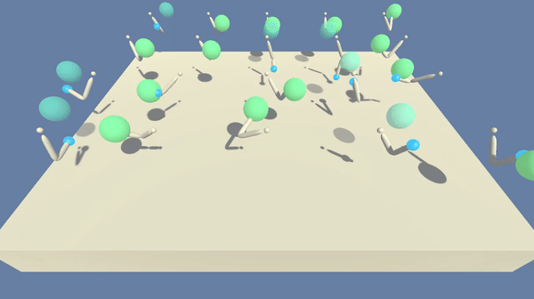

# Udacity Deep Reinforcement Learning Nanodegree Projects
 
This repository contains the Udacity's Deep Reinforcement Learning Nanodegree projects.

## Table of Contents

1. [Project Details](#project-details)
    1. [Continuous Control](#continuous-control)
        1. [State-Action Represenation](#state-action-represenation)
        1. [Reward](#reward)
1. [Getting Started & Dependencies](#getting-started-and-dependencies)
1. [Instructions](#instructions)

---

## Project Details



### [Continuous Control](./p2_navigation/Report.md)

The Continuous Control project is based on the [Reacher](https://github.com/Unity-Technologies/ml-agents/blob/master/docs/Learning-Environment-Examples.md#reacher) environment from [Unity ML-Agents](https://github.com/Unity-Technologies/ml-agents). The environment simulates raching task for robot manipulators. Two versions of the environment was provided: a) single agent; and b) Multi-agent with 20 identical agents. For each agent (robot) in the environement, a dynamic target location is defined, shown as green spheres. Robots are suppsoed to track and reach to their target points. The goal in this project is to implement and train an agent to move its hand to the target location, and follow the target location as many time steps as possible. The agent receives +0.1 reward for each timstep that the agent's hand is in the target location. The task is episodic, and the environment is considered to be solved when the agent(s) get an average score of +30 over 100 consecutive episodes. 

#### State-Action Represenation

- Observation space type: continuous
    - Observation space size (per agent): 33, corresponding to:
        - position, rotation, velocity, and angular velocities of the arms
- Action space type: discrete
    - Action space size (per agent): 4, corresponding to:
        - 0: torque_x applied to the 1st joint 
        - 1: torque_z applied to the 1st joint 
        - 2: torque_x applied to the 2nd joint 
        - 3: torque_z applied to the 2nd joint 
        
#### Reward

Each agent in the environment receives a reward of +0.1 for each timstep that the agent's hand is in the target location.

## Getting Started and Dependencies

This project depends on Banana environment and PyTorch along with some other Python packages. Follow the instructions below to install the dependencies and set up the python environment:

0. Download the Reacher environment that matches your operating system:
    - **_Version 1: Single Agent_**
        - Linux: [click here](https://s3-us-west-1.amazonaws.com/udacity-drlnd/P2/Reacher/one_agent/Reacher_Linux.zip)
        - Mac OSX: [click here](https://s3-us-west-1.amazonaws.com/udacity-drlnd/P2/Reacher/one_agent/Reacher.app.zip)
        - Windows (32-bit): [click here](https://s3-us-west-1.amazonaws.com/udacity-drlnd/P2/Reacher/one_agent/Reacher_Windows_x86.zip)
        - Windows (64-bit): [click here](https://s3-us-west-1.amazonaws.com/udacity-drlnd/P2/Reacher/one_agent/Reacher_Windows_x86_64.zip)
    - **_Version 2: Multi Agents (20)_**
        - Linux: [click here](https://s3-us-west-1.amazonaws.com/udacity-drlnd/P2/Reacher/Reacher_Linux.zip)
        - Mac OSX: [click here](https://s3-us-west-1.amazonaws.com/udacity-drlnd/P2/Reacher/Reacher.app.zip)
        - Windows (32-bit): [click here](https://s3-us-west-1.amazonaws.com/udacity-drlnd/P2/Reacher/Reacher_Windows_x86.zip)
        - Windows (64-bit): [click here](https://s3-us-west-1.amazonaws.com/udacity-drlnd/P2/Reacher/Reacher_Windows_x86_64.zip)

1. Place the file in the DRLND GitHub repository, in the `p2_continuous-control/` folder, and unzip (or decompress) the file. 
2. Download and install [miniconda3](https://conda.io/miniconda.html).
3. Create the miniconda environment:
```bash
conda env create -f environment.yml
```
4. Verify the `drlnd` environment:Instructions
```bahs
conda info --envs
```
5. Clean up downloaded packages:
```bash
conda clean -tp
```
6. Activate `drlnd` conda environment:
```bash
conda activate drlnd
```
7. Clone the [Udacity's deep-reinforcement-learning repository](https://github.com/udacity/deep-reinforcement-learning), and navigate to the repository folder to install the additional dependencies including the ML-Agents toolkit, and a few more Python packages required for this project:
```bash
git clone https://github.com/udacity/deep-reinforcement-learning.git
cd deep-reinforcement-learning
pip -q install ./python
```
8. Create an [IPython kernel](http://ipython.readthedocs.io/en/stable/install/kernel_install.html) for the `drlnd` environment.  
```bash
python -m ipykernel install --user --name drlnd --display-name "drlnd"
```
9. Run jupyter notebook.
```bash
jupyter-notebook .
```
10. Before running the jupyter notebooks, make sure the kernel is set to `drlnd`. If not, change the environment by using the drop-down `Kernel` menu. 

## Instructions

- Navigation:
    - Project folder: [p2_continuous-control/](./p2_continuous-control/)
    - Project files:
        - [Report.ipynb](./p2_continuous-control/Report.ipynb): project report and solution
        - [actor_critic.py](./p2_continuous-control/actor_critic.py): the neural network model architecture
        - [utils.py](./p2_continuous-control/utils.py): utilities for creating network
        - [Continuous_Control_Solution.ipynb](./p2_continuous-control/Continuous_Control_Solution.ipynb): PPO implementation, training, and evaluation
        - [eval_ppo.py](./p2_continuous-control/eval_ppo.py): evaluation script to test the save model
        - [ppo_128x64_a0_c0_470e.pth](./p2_continuous-control/ppo_128x64_a0_c0_470e.pth): saved model weights
    - Refer to [/p2_continuous-control](./p2_continuous-control) folder for the solution implementation and [report](./p2_continuous-control/Report.ipynb). 
