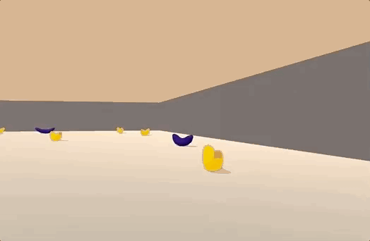
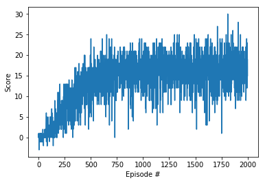

# Udacity Deep Reinforcement Learning Nanodegree Projects
 
This repository contains the Udacity's Deep Reinforcement Learning Nanodegree projects.

## Table of Contents

1. [Project Details](#project-details)
    1. [Navigation](#navigation)
        1. [State-Action Represenation](#state-action-represenation)
        1. [Reward](#reward)
1. [Getting Started & Dependencies](#getting-started-and-dependencies)
1. [Instructions](#instructions)

---

## Project Details



### [Navigation](./p1_navigation/Report.ipynb)

The Navigation project is based on the [Banana Collector](https://github.com/Unity-Technologies/ml-agents/blob/master/docs/Learning-Environment-Examples.md#banana-collector) environment from [Unity ML-Agents](https://github.com/Unity-Technologies/ml-agents). The goal in this project is to implement and train a DQN agent to collect yellow bananas while avoiding blue bananas. The task is episodic, and the environment is solved when agent reaches an average score of +13 over 100 consecutive episodes.

`NOTE:` The project environment is similar to, but not identical to the Banana Collector environment from Unity ML-Agents.

#### State-Action Represenation

- Observation space type: continuous
    - Observation space size (per agent): 37, corresponding to:
        - velocity of agent
        - ray-based perception of objects around agent's forward direction
- Action space type: discrete
    - Action space size (per agent): 4, corresponding to:
        - 0: move forward
        - 1: move backward
        - 2: turn left
        - 3: turn right
        
#### Reward

The agent receives a reward of +1 for collecting a yellow banana, and a reward of -1 if collecting a blue banana.

## Result

A vanilla DQN agent was considered for this project. The environment was solved in less than 600 episodes:

```bash
Episode 100     Average Score: 0.53
Episode 200     Average Score: 3.04
Episode 300     Average Score: 7.31
Episode 400     Average Score: 9.53
Episode 500     Average Score: 12.25
Episode 600     Average Score: 14.07 --> (13+ average score in less than 600 episodes)
Episode 700     Average Score: 14.71
Episode 800     Average Score: 15.47
Episode 900     Average Score: 15.98
Episode 1000    Average Score: 16.28
Episode 1100    Average Score: 16.39
Episode 1200    Average Score: 16.39
Episode 1300    Average Score: 16.42
Episode 1400    Average Score: 16.44
Episode 1500    Average Score: 16.34
Episode 1600    Average Score: 16.31
Episode 1700    Average Score: 16.34
Episode 1800    Average Score: 16.60
Episode 1900    Average Score: 16.96
Episode 2000    Average Score: 16.29
```




## Getting Started and Dependencies

This project depends on Banana environment and PyTorch along with some other Python packages. Follow the instructions below to install the dependencies and set up the python environment:

0. Download the Banana environment that matches your operating system:
    - Linux: [download here](https://s3-us-west-1.amazonaws.com/udacity-drlnd/P1/Banana/Banana_Linux.zip)
    - Mac OSX: [download here](https://s3-us-west-1.amazonaws.com/udacity-drlnd/P1/Banana/Banana.app.zip)
    - Windows (32-bit): [download here](https://s3-us-west-1.amazonaws.com/udacity-drlnd/P1/Banana/Banana_Windows_x86.zip)
    - Windows (64-bit): [download here](https://s3-us-west-1.amazonaws.com/udacity-drlnd/P1/Banana/Banana_Windows_x86_64.zip)

1. Download and install [miniconda3](https://conda.io/miniconda.html).
2. Create the miniconda environment:
```bash
conda env create -f environment.yml
```
3. Verify the `drlnd` environment:Instructions
```bahs
conda info --envs
```
4. Clean up downloaded packages:
```bash
conda clean -tp
```
5. Activate `drlnd` conda environment:
```bash
conda activate drlnd
```
6. Clone the [Udacity's deep-reinforcement-learning repository](https://github.com/udacity/deep-reinforcement-learning), and navigate to the repository folder to install the additional dependencies including the ML-Agents toolkit, and a few more Python packages required for this project:
```bash
git clone https://github.com/udacity/deep-reinforcement-learning.git
cd deep-reinforcement-learning
pip -q install ./python
```
7. Create an [IPython kernel](http://ipython.readthedocs.io/en/stable/install/kernel_install.html) for the `drlnd` environment.  
```bash
python -m ipykernel install --user --name drlnd --display-name "drlnd"
```
8. Run jupyter notebook.
```bash
jupyter-notebook .
```
9. Before running the jupyter notebooks, make sure the kernel is set to `drlnd`. If not, change the environment by using the drop-down `Kernel` menu. 

## Instructions

- Navigation:
    - Project folder: [p1_navigation](./p1_navigation)
    - Project files:
        - [Report.ipynb](./p1_navigation/Report.ipynb): project report and solution
        - [dqn_agent.py](./p1_navigation/dqn_agent.py): dqn implementation
        - [replay_buffer.py](./p1_navigation/replay_buffer.py): replay buffer implementation
        - [model.py](./p1_navigation/model.py): the neural network model architecture
        - [banana-32-32-checkpoint.pth](./p1_navigation/banana-32-32-checkpoint.pth): saved model weights
        - [training_plot.png](./p1_navigation/training_plot.png): the training plot showing reward per episode
    - Refer to [/p1_navigation](./p1_navigation) folder for the solution implementation and [report](./p1_navigation/Report.ipynb). 
