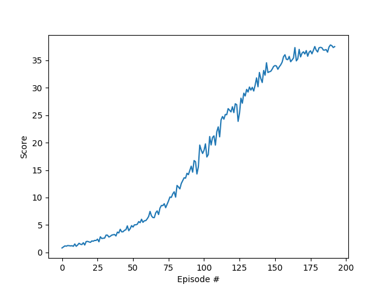

# Udacity Deep Reinforcement Learning Nanodegree Projects

<p align="center">
    
    
    
</p>

This repository contains the Udacity's Deep Reinforcement Learning Nanodegree projects.

## Table of Contents

1. [Project Details](#project-details)
    1. [Navigation](#navigation)
        1. [State-Action Represenation](#state-action-represenation)
        1. [Reward](#reward)
    1. [Continuous Control](#continuous-control)
        1. [State-Action Represenation](#state-action-represenation-1)
        1. [Reward](#reward-1)
    1. [Collaboration and Competition](#collaboration-and-competition)
        1. [State-Action Represenation](#state-action-represenation-2)
        1. [Reward](#reward-2)
1. [Getting Started & Dependencies](#getting-started-and-dependencies)
1. [Instructions](#instructions)


## Project Details

### [Navigation](./p1_navigation/Report.ipynb)


The Navigation project is based on the [Banana Collector](https://github.com/Unity-Technologies/ml-agents/blob/master/docs/Learning-Environment-Examples.md#banana-collector) environment from [Unity ML-Agents](https://github.com/Unity-Technologies/ml-agents). The goal in this project is to implement and train a DQN agent to collect yellow bananas while avoiding blue bananas. The task is episodic, and the environment is solved when agent reaches an average score of +13 over 100 consecutive episodes.
`NOTE:` The project environment is similar to, but not identical to the Banana Collector environment from Unity ML-Agents.

#### State-Action Represenation

- Observation space type: continuous
    - Observation space size (per agent): 37, corresponding to:
        - velocity of agent
        - ray-based perception of objects around agent's forward direction
- Action space type: discrete
    - Action space size (per agent): 4, corresponding to:
        - 0: move forward
        - 1: move backward
        - 2: turn left
        - 3: turn right
        
#### Reward

The agent receives a reward of +1 for collecting a yellow banana, and a reward of -1 if collecting a blue banana.

#### Result

A DQN agent was implemented for this project. The environment was solved in less than 600 episodes:


### [Continuous Control](./p2_continuous-control/Report.md)


The Continuous Control project is based on the [Reacher](https://github.com/Unity-Technologies/ml-agents/blob/master/docs/Learning-Environment-Examples.md#reacher) environment from [Unity ML-Agents](https://github.com/Unity-Technologies/ml-agents). The environment simulates raching task for robot manipulators. Two versions of the environment was provided: a) single agent; and b) Multi-agent with 20 identical agents. For each agent (robot) in the environement, a dynamic target location is defined, shown as green spheres. Robots are suppsoed to track and reach to their target points. The goal in this project is to implement and train an agent to move its hand to the target location, and follow the target location as many time steps as possible. The agent receives +0.1 reward for each timstep that the agent's hand is in the target location. The task is episodic, and the environment is considered to be solved when the agent(s) get an average score of +30 over 100 consecutive episodes. 

#### State-Action Represenation

- Observation space type: continuous
    - Observation space size (per agent): 33, corresponding to:
        - position, rotation, velocity, and angular velocities of the arms
- Action space type: discrete
    - Action space size (per agent): 4, corresponding to:
        - 0: torque_x applied to the 1st joint 
        - 1: torque_z applied to the 1st joint 
        - 2: torque_x applied to the 2nd joint 
        - 3: torque_z applied to the 2nd joint 
        
#### Reward

Each agent in the environment receives a reward of +0.1 for each timstep that the agent's hand is in the target location.

#### Result

The environment was solved in less than 200 episodes by implementing a PPO agent:



### [Collaboration and Competition](./p3_collab-compet/Report.md)


The Collaboration and Competition project is based on the [Tennis](https://github.com/Unity-Technologies/ml-agents/blob/master/docs/Learning-Environment-Examples.md#tennis)
environment from [Unity ML-Agents](https://github.com/Unity-Technologies/ml-agents).
The environment simulates a two-player table tennis game, where agents control rackets to bounce ball over a net.
The goal in this project is to implement and train an agent to control the players to keep the ball in play. Each player receives a reward of +0.1 if it hits the ball over the net, 
and -0.1 if it lets the ball hit the ground or go out of bounds.
The task is episodic, and the environment is considered solved when the agent reaches an average score of +0.5 over 100 consecutive episodes. 

#### State-Action Represenation

- Observation space type: continuous
    - Observation space size (per agent): 8, corresponding to:
        - position and velocity of ball and racket
- Action space type: discrete
    - Action space size (per agent): 2 (continuous), corresponding to:
        - movement toward net or away from net, and jumping

#### Reward

- +0.1 if the player hits the ball over net.
- -0.1 if the player let ball hit the ground, or hit ball out of bounds.

#### Results

The environment was solved in about 200 episodes using a PPO agent:

<p align="left">
    
    
</p>

## Getting Started and Dependencies

This project depends on Banana environment and PyTorch along with some other Python packages. Follow the instructions below to install the dependencies and set up the python environment:

1. Download the Banana environment that matches your operating system:
    - Linux: [download here](https://s3-us-west-1.amazonaws.com/udacity-drlnd/P1/Banana/Banana_Linux.zip)
    - Mac OSX: [download here](https://s3-us-west-1.amazonaws.com/udacity-drlnd/P1/Banana/Banana.app.zip)
    - Windows (32-bit): [download here](https://s3-us-west-1.amazonaws.com/udacity-drlnd/P1/Banana/Banana_Windows_x86.zip)
    - Windows (64-bit): [download here](https://s3-us-west-1.amazonaws.com/udacity-drlnd/P1/Banana/Banana_Windows_x86_64.zip)
1. Place the file in the DRLND GitHub repository, in the `p1_navigation/` folder, and unzip (or decompress) the file.
1. Download the Reacher environment that matches your operating system:
    - **Version 1: Single-Agent**
        - Linux: [click here](https://s3-us-west-1.amazonaws.com/udacity-drlnd/P2/Reacher/one_agent/Reacher_Linux.zip)
        - Mac OSX: [click here](https://s3-us-west-1.amazonaws.com/udacity-drlnd/P2/Reacher/one_agent/Reacher.app.zip)
        - Windows (32-bit): [click here](https://s3-us-west-1.amazonaws.com/udacity-drlnd/P2/Reacher/one_agent/Reacher_Windows_x86.zip)
        - Windows (64-bit): [click here](https://s3-us-west-1.amazonaws.com/udacity-drlnd/P2/Reacher/one_agent/Reacher_Windows_x86_64.zip)
    - **Version 2: Multi-Agent**
        - Linux: [click here](https://s3-us-west-1.amazonaws.com/udacity-drlnd/P2/Reacher/Reacher_Linux.zip)
        - Mac OSX: [click here](https://s3-us-west-1.amazonaws.com/udacity-drlnd/P2/Reacher/Reacher.app.zip)
        - Windows (32-bit): [click here](https://s3-us-west-1.amazonaws.com/udacity-drlnd/P2/Reacher/Reacher_Windows_x86.zip)
        - Windows (64-bit): [click here](https://s3-us-west-1.amazonaws.com/udacity-drlnd/P2/Reacher/Reacher_Windows_x86_64.zip)
1. Place the file in the DRLND GitHub repository, in the `p2_continuous-control/` folder, and unzip (or decompress) the file.
0. Download the Reacher environment that matches your operating system:
    - Linux: [click here](https://s3-us-west-1.amazonaws.com/udacity-drlnd/P3/Tennis/Tennis_Linux.zip)
    - Mac OSX: [click here](https://s3-us-west-1.amazonaws.com/udacity-drlnd/P3/Tennis/Tennis.app.zip)
    - Windows (32-bit): [click here](https://s3-us-west-1.amazonaws.com/udacity-drlnd/P3/Tennis/Tennis_Windows_x86.zip)
    - Windows (64-bit): [click here](https://s3-us-west-1.amazonaws.com/udacity-drlnd/P3/Tennis/Tennis_Windows_x86_64.zip)
1. Place the file in the DRLND GitHub repository, in the `p3_collab-compet/` folder, and unzip (or decompress) the file. 
1. Download and install [miniconda3](https://conda.io/miniconda.html).
1. Create the miniconda environment:
```bash
conda env create -f environment.yml
```
1. Verify the `drlnd` environment:Instructions
```bahs
conda info --envs
```
1. Clean up downloaded packages:
```bash
conda clean -tp
```
1. Activate `drlnd` conda environment:
```bash
conda activate drlnd
```
1. Clone the [Udacity's deep-reinforcement-learning repository](https://github.com/udacity/deep-reinforcement-learning), and navigate to the repository folder to install the additional dependencies including the ML-Agents toolkit, and a few more Python packages required for this project:
```bash
git clone https://github.com/udacity/deep-reinforcement-learning.git
cd deep-reinforcement-learning
pip -q install ./python
```
1. Create an [IPython kernel](http://ipython.readthedocs.io/en/stable/install/kernel_install.html) for the `drlnd` environment.  
```bash
python -m ipykernel install --user --name drlnd --display-name "drlnd"
```
1. Run jupyter notebook.
```bash
jupyter-notebook .
```
1. Before running the jupyter notebooks, make sure the kernel is set to `drlnd`. If not, change the environment by using the drop-down `Kernel` menu. 

## Instructions

- Navigation:
    - Project folder: [p1_navigation](./p1_navigation)
    - Project files:
        - [Report.ipynb](./p1_navigation/Report.ipynb): project report and solution
        - [dqn_agent.py](./p1_navigation/dqn_agent.py): dqn implementation
        - [replay_buffer.py](./p1_navigation/replay_buffer.py): replay buffer implementation
        - [model.py](./p1_navigation/model.py): the neural network model architecture
        - [banana-32-32-checkpoint.pth](./p1_navigation/banana-32-32-checkpoint.pth): saved model weights
        - [training_plot.png](./p1_navigation/training_plot.png): the training plot showing reward per episode
    - Refer to [/p1_navigation](./p1_navigation) folder for the solution implementation and [report](./p1_navigation/Report.ipynb). 
- Continuous Control:
    - Project folder: [p2_continuous-control/](./p2_continuous-control/)
    - Project files:
        - [Report.md](./p2_continuous-control/Report.md): project report and solution
        - [actor_critic.py](./p2_continuous-control/actor_critic.py): the neural network model architecture
        - [utils.py](./p2_continuous-control/utils.py): utilities for creating network
        - [Continuous_Control_Solution.ipynb](./p2_continuous-control/Continuous_Control_Solution.ipynb): PPO implementation, training, and evaluation
        - [eval_ppo.py](./p2_continuous-control/eval_ppo.py): evaluation script to test the save model
        - [ppo_128x64_a0_c0_470e.pth](./p2_continuous-control/ppo_128x64_a0_c0_470e.pth): saved model weights
    - Refer to [/p2_continuous-control](./p2_continuous-control) folder for the solution implementation and [report](./p2_continuous-control/Report.md). 
    - Project folder: [p3_collab-compet/](./p3_collab-compet/)
- Collaboration and Competition:
    - Project files:
        - [Report.md](./p3_collab-compet/Report.md): project report and solution
        - [actor_critic.py](./p3_collab-compet/actor_critic.py): the neural network model architecture
        - [utils.py](./p3_collab-compet/utils.py): utilities for creating network
        - [Tennis-PPO.ipynb](./p3_collab-compet/Tennis-PPO.ipynb): PPO implementation, training, and evaluation
        - [ppo_128x128_a64_c64_207e.pth](./p3_collab-compet/ppo_128x128_a64_c64_207e.pth): saved model weights for 207 episodes of training
        - [ppo_128x128_a64_c64_2000e.pth](./p3_collab-compet/ppo_128x128_a64_c64_2000e.pth): saved model weights for 2000 episodes of training
    - Refer to [/p3_collab-compet](./p3_collab-compet) folder for the solution implementation and [report](./p3_collab-compet/Report.md). 
