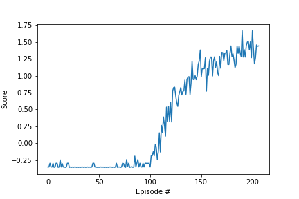

# Performance Report

## Environment and Dependencies

Refer to [README](./../README.md) for the environment description and dependencies.

## Learning Algorithm
For this project, **PPO (Proximal Policy Optimization)**
was implemented given continuous nature of the problem. **PPO** is a policy gradient method.  Compared to **TRPO (Trust Region Policy Optimization)**,
PPO is more general, simpler to implement, and is known to have higher sampling efficieny.
PPO calculates gradient based on the policy likelihood ratio between old and new policy, and leverages ratio clipping
to avoid gradient explosion. [GAE (Generalized Advantage Estimation)](https://arxiv.org/abs/1506.02438) method was used to estimate the advantage function.

## Result & Plot of Rewards
The environment was solved in under 180 episodes and reached 0.5 score in average. The training was continued to get an average score of 1.0:

```bash
Episode: 10, average score: -0.33
Episode: 20, average score: -0.33
Episode: 30, average score: -0.33
Episode: 40, average score: -0.34
Episode: 50, average score: -0.34
Episode: 60, average score: -0.34
Episode: 70, average score: -0.34
Episode: 80, average score: -0.34
Episode: 90, average score: -0.34
Episode: 100, average score: -0.33
Episode: 110, average score: -0.32
Episode: 120, average score: -0.25
Episode: 130, average score: -0.15
Episode: 140, average score: -0.03
Episode: 150, average score: 0.11
Episode: 160, average score: 0.25
Episode: 170, average score: 0.40
Episode: 180, average score: 0.56
Episode: 190, average score: 0.73
Episode: 200, average score: 0.90
Environment solved in 207 episodes!	Average Score: 1.01
Average Score: 1.01
Elapsed time: 0:09:01.293255
```

The following figure illustrates the average score over time obtained during training:



To observe the maximum performance, the training was continued for 2000 episodes and 1000 steps per episode.
The result is shown in the following figure. The training is stable and the score does not collapsed:


The saved model after 2000 episodes was evaluated by loading `ppo_128x128_a64_c64_2000e.pth` model:


## Network Architecture
An actor-critic structure with continuous action space was used for this project. The policy consists of 3 parts, a shared hidden layers, actor, and critic.
The actor layer outputs the mean value of a normal distribution, from which the agent's action is sampled. The critic layer yields the value function.

- Shared layer:
```
Input State(33) -> Dense(128) -> LeakyReLU -> Dense(128) -> LeakyReLU*
```
- Actor and Critic layers:
```
LeakyRelu* -> Dense(64) -> LeakyRelu -> Dense(4)-> tanh -> Actor's output
LeakyReLU* -> Dense(64) -> LeakyRelu -> Dense(1) -> Critic's output
```

### Model update using PPO/GAE
The hyperparameters used during training are:

Parameter | Value | Description
------------ | ------------- | -------------
Number of Agents | 20 | Number of agents trained simultaneously
Episodes | 2000 | Maximum number of training episodes
tmax | 1000 | Maximum number of steps per episode
Epochs | 10 | Number of training epoch per batch sampling
Batch size | 128*20 | Size of batch taken from the accumulated  trajectories
Discount (gamma) | 0.99 | Discount rate 
Epsilon | 0.1 | Ratio used to clip r = new_probs/old_probs during training
Gradient clip | 10.0 | Maximum gradient norm 
Beta | 0.01 | Entropy coefficient 
Tau | 0.95 | tau coefficient in GAE
Learning rate | 2e-4 | Learning rate 
Optimizer | Adam | Optimization method

## Ideas for Future Work
0. Extensive hyperparameter optimization and analysis
1. Further analysis on PPO to study the effect of clipping and loss error variatoin including fixed and adaptive KL penalty as done in TRPO
2. Performance comparison with [A3C](https://openreview.net/pdf?id=SyZipzbCb), [DDPG](https://arxiv.org/abs/1509.02971), and [D4PG](https://arxiv.org/pdf/1602.01783.pdf)
3. Extension to other environments such as [Crawler](https://github.com/Unity-Technologies/ml-agents/blob/master/docs/Learning-Environment-Examples.md#crawler) 
and [Walker](https://github.com/Unity-Technologies/ml-agents/blob/master/docs/Learning-Environment-Examples.md#walker)
